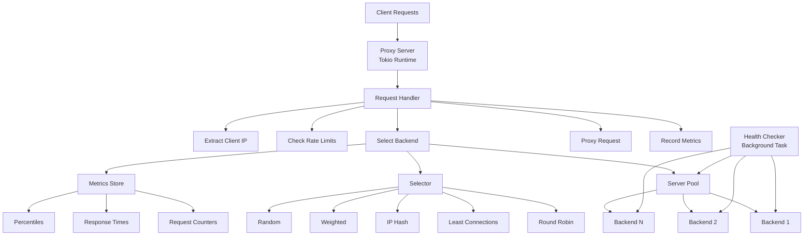
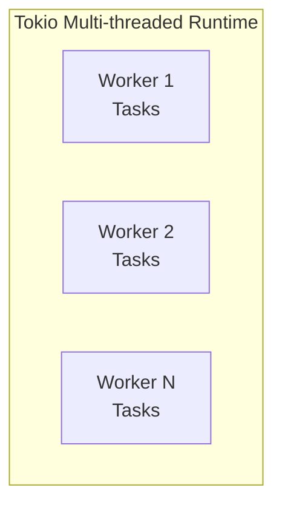

## System Architecture

UltraBalancer is built with a modular, high-performance architecture leveraging Rust's async capabilities.



## Core Modules

### Backend Module

Manages backend servers and their state.

<CardGroup cols={2}>
  <Card title="Server" icon="server">
    Individual backend representation with health tracking
  </Card>
  <Card title="Server Pool" icon="layer-group">
    Collection of servers with concurrent-safe operations
  </Card>
  <Card title="Health Tracker" icon="heart-pulse">
    Monitors backend health and updates status
  </Card>
  <Card title="Circuit Breaker" icon="shield-halved">
    Prevents cascading failures
  </Card>
</CardGroup>

**Key Features:**
- Lock-free status updates using atomics
- Arc-based shared state for zero-copy semantics
- DashMap for concurrent server access
- Per-server connection counting

**File Structure:**
```
src/backend/
├── mod.rs                 # Module exports
├── server.rs              # Server representation
├── pool.rs                # Server pool management
└── health_tracker/
    ├── mod.rs            # Health tracker exports
    ├── checker.rs        # Health checking logic
    └── circuit_breaker.rs # Circuit breaker pattern
```

### Balancer Module

Implements load balancing algorithms.

**Architecture:**
- **Algorithm enum**: Defines available algorithms
- **Selector**: Unified interface for backend selection
- **Algorithm implementations**: Individual algorithm logic

**File Structure:**
```
src/balancer/
├── mod.rs              # Module exports
├── selector.rs         # Unified selector interface
└── algorithms/
    ├── mod.rs         # Algorithm exports
    ├── round_robin.rs # Round robin implementation
    ├── least_connections.rs
    ├── ip_hash.rs
    ├── weighted.rs
    └── random.rs
```

**Design Principles:**
- Each algorithm is self-contained
- Stateless where possible
- Thread-safe state management
- Zero-allocation in hot paths

### Proxy Module

Handles HTTP proxying and request routing.

**Components:**
- **ProxyServer**: Manages TCP listener and connection dispatch
- **RequestHandler**: Processes individual HTTP requests
- **Middleware**: (Future) Request/response transformation

**File Structure:**
```
src/proxy/
├── mod.rs     # Proxy server
└── handler.rs # Request handling
```

**Request Flow:**
1. Accept TCP connection
2. Parse HTTP request
3. Extract client metadata
4. Select backend via algorithm
5. Proxy request to backend
6. Stream response to client
7. Record metrics

### Metrics Module

Collects and exports performance metrics.

**Collectors:**
- **MetricsCollector**: Thread-safe metric storage
- **MetricsExporter**: Formats metrics for export

**Tracked Metrics:**
- Request counters (total, success, failed)
- Response time statistics (avg, min, max, percentiles)
- Uptime and throughput
- Per-backend connection counts

**File Structure:**
```
src/metrics/
├── mod.rs        # Module exports
├── collector.rs  # Metric collection
└── exporter.rs   # Metric formatting
```

### Configuration Module

Handles configuration parsing and validation.

**File Structure:**
```
src/config/
├── mod.rs        # Config structures
├── parser.rs     # YAML/TOML parsing
└── validator.rs  # Configuration validation
```

**Supported Formats:**
- YAML (primary)
- TOML (supported)
- CLI arguments (override)

### Error Module

Centralized error handling with thiserror.

```rust
pub enum LoadBalancerError {
    NoHealthyBackends,
    BackendSelectionFailed(String),
    InvalidBackendAddress(String),
    ConfigError(String),
    // ... more error types
}
```

### Utils Module

Shared utilities for advanced features.

- **ConnectionPool**: Per-backend connection limits
- **RateLimiter**: Token bucket rate limiting

## Concurrency Model

### Tokio Async Runtime

UltraBalancer uses **Tokio** for async I/O:



**Key Features:**
- Work-stealing scheduler
- Automatic load balancing
- Configurable thread pool size
- Async/await throughout

### Shared State Management

**Lock-Free Operations:**
- Atomic counters for metrics
- Arc + RwLock for read-heavy data
- DashMap for concurrent HashMap

**Zero-Copy Semantics:**
- Arc wrapping for shared ownership
- Clone = reference count increment
- No data duplication

## Performance Optimizations

<AccordionGroup>
  <Accordion title="Memory Management">
    - **Arc-based sharing**: No unnecessary copies
    - **Pre-allocated buffers**: Reduced allocations
    - **Connection pooling**: Reuse TCP connections
    - **Lock-free structures**: Minimize contention
  </Accordion>

  <Accordion title="CPU Efficiency">
    - **Async I/O**: No thread per connection
    - **Work stealing**: Optimal CPU utilization
    - **Zero-copy proxying**: Minimal data movement
    - **Efficient algorithms**: O(1) for most operations
  </Accordion>

  <Accordion title="Network Optimization">
    - **Keep-alive connections**: Reduce handshakes
    - **Connection pooling**: Reuse backend connections
    - **Streaming responses**: Low memory footprint
    - **Efficient parsing**: Minimal overhead
  </Accordion>
</AccordionGroup>

## Build Configuration

### Release Profile

Optimized for maximum performance:

```toml Cargo.toml
[profile.release]
opt-level = 3        # Maximum optimizations
lto = true           # Link-time optimization
codegen-units = 1    # Single codegen unit for better optimization
strip = true         # Remove debug symbols
```

### Dependencies

**Core:**
- `tokio`: Async runtime
- `hyper`: HTTP implementation
- `tower`: Service abstractions

**Data Structures:**
- `parking_lot`: Fast synchronization primitives
- `dashmap`: Concurrent HashMap
- `arc-swap`: Lock-free Arc swapping

**Utilities:**
- `tracing`: Structured logging
- `serde`: Serialization
- `anyhow`/`thiserror`: Error handling

## Deployment Architecture

### Single Instance

```
Internet → UltraBalancer → [Backend1, Backend2, Backend3]
```

Simple deployment for moderate traffic.

### High Availability

```
Internet → DNS Round Robin
            ├─→ UltraBalancer-1 → Backends
            └─→ UltraBalancer-2 → Backends
```

Multiple UltraBalancer instances for redundancy.

### Multi-Tier with CDN

```
Internet → CDN
           └─→ UltraBalancer (L7)
                └─→ [App Server 1, App Server 2, App Server 3]
```

Front CDN with UltraBalancer for application layer load balancing.

## Security Considerations

<Warning>
  **Production Checklist:**
  - Run as unprivileged user
  - Use firewall rules to restrict access
  - Enable TLS termination upstream (nginx/caddy)
  - Implement rate limiting
  - Monitor for anomalous traffic
  - Keep dependencies updated
</Warning>

## Next Steps

<CardGroup cols={2}>
  <Card title="Algorithms" icon="brain" href="/concepts/algorithms">
    Understand load balancing strategies
  </Card>
  <Card title="Health Checks" icon="heart-pulse" href="/concepts/health-checks">
    Learn about failover
  </Card>
  <Card title="Metrics" icon="chart-line" href="/concepts/metrics">
    Monitoring and observability
  </Card>
  <Card title="Production" icon="rocket" href="/guides/production-deployment">
    Deploy to production
  </Card>
</CardGroup>
